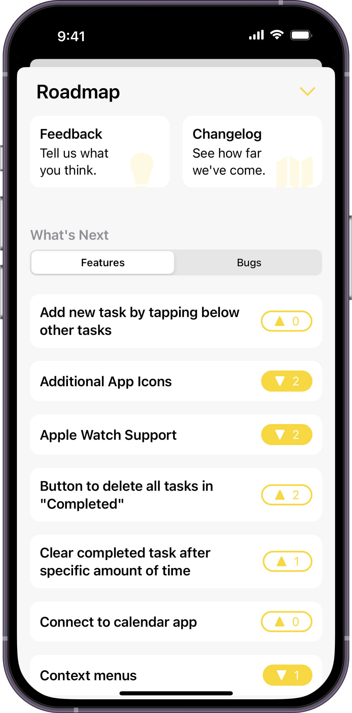
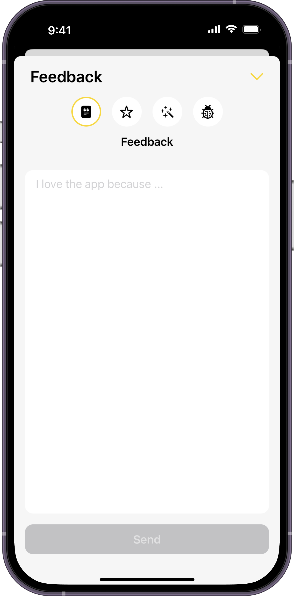
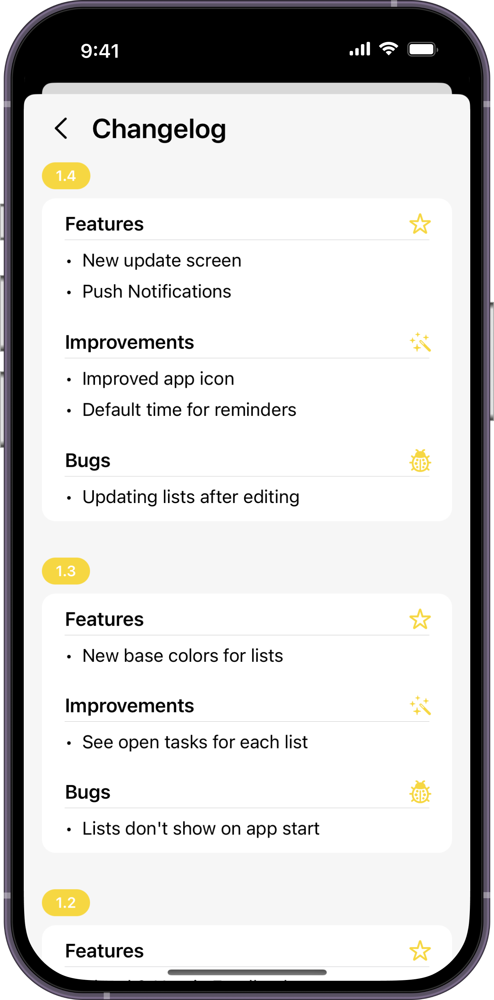

# RoadKit

RoadKit enables you to track user feedback for iOS and macOS apps. You can easily integrate the SDK into all of your apps to receive feedback and show what features and bugs you are currently working on. Our voting feature enables you to track what's important to your users, so you can prioritize accordingly. Additionally, you can display a changelog to let everyone know how far your app has come.

Our preset provides everything you need:
- [x] Display your planned features and bugs
- [x] Changelog, grouped by version and type
- [x] A view to submit feedback, feature requests and bug reports

It is built in 100% SwiftUI, optimized for iOS, iPadOS and macOS and localized in English and German.


---


## Content
- [Features](#features)
- [Screenshots](#screenshots)
- [Installation](#installation)
- [How to Use](#how-to-use)


## Features
- [x] Fetch topics for your app
- [x] Post a new topic (Feedback, Feature, Improvement or Bug)
- [x] Vote for a topic
- [x] Undo votes for a topic
- [x] Get if the current user has voted for a topic


## Screenshots
This is a working example of how our preset looks:

  


## Installation
#### Requirements
The SDK requires an account for RoadKit with a registered project.

- iOS 16.0+ / macOS 13.0
- Xcode 14+
- Swift 5.7+

#### Swift Package Manager
In Xcode, go to `File > Add Packages` and add `https://github.com/hyperlinkgroup/roadkit-sdk-ios`. Add the package to your desired targets.


## How to Use
#### Setup
To setup RoadKit, you need to initialize the SDK with your project's ID, declare the setup method and (optionally) provide a UserID. The ProjectID can be found in your app under the info tab of the respective app. There are two ways to setup RoadKit: `.anonymously`  or `.userID`. If you select anonymous setup, a UUID is created in the background and saved on the user's device, so that multiple votings from the same device are forbidden. 
If you choose `.userID` as Setup-Mode, you need to provide the user's ID, otherwise an error is thrown.
```Swift
import RoadKitSwift

RoadKitManager.shared.setupRoadKit(projectID: <String>, mode: .anonymous)
or
RoadKitManager.shared.setupRoadKit(projectID: <String>, mode: .userID, userID: <String>)
```

You can change the Setup-Mode later, in case a user logs in or out:
```Swift
RoadKitManager.shared.switchToAnonymousMode()
or
RoadKitManager.shared.switchToUserIDMode(userID: <String>)
``` 

If your user changes, you can call the following function to update the UserID:
```Swift
RoadKitManager.shared.updateUserID(with: <String>)
```

## Using RoadKit with our preset
Our preset offers you ready-to-use views and built-in capabilities, so you can use RoadKit to it's full extend. You only need to show the Roadmap view, from where your users can vote and suggest features or look at your changelog.

**Important**: The preset accesses the topics you saved in your RoadKit app. If you haven't added any data there, nothing will appear. Also note that topics submitted from your users will **not** show up automatically, you need to publish them in the app.

#### Setup

To display the roadmap view, you only need to call it, either directly within an existing view or from a sheet. The example shows how to show it with a sheet:

```Swift
var body: some View {
  VStack {
    Button {
      shouldShowRoadmap.toggle()
    } label: {
      Text("Show Roadmap")
    }
  }
  .sheet(isPresented: $shouldShowRoadmap) {
    RoadmapView(isPresented: $shouldShowRoadmap,
                primaryBackgroundColor: <Color>,
                secondaryBackgroundColor: <Color>,
                foregroundColor: <Color>)
  }
}


@State var shouldShowRoadmap = false
```

As parameters, pass the colors you'd like to have for the view's background and foreground.


## Using RoadKit manually
If you don't want to use our preset to have more granular control, you can do that anytime.

#### Fetching Topics
All published topics are fetched and kept in the `RoadKitManager` within the package.
To fetch topics you need to `import RoadKit` on top of your file and call:
```Swift
RoadKitManager.shared.fetchTopics()
```
This can be done from any file you want. Topics are stored as a `CurrentValueSubject` using the `Combine` framework. It is best to use combine to read the values by using the `.sink` method and store the results. An example using SwiftUI would be:
```Swift
@ObservedObject var roadkitManager = RoadKitManager.shared
private var cancellables = Set<AnyCancellable>()

roadkitManager.topics
    .sink { [weak self] topics in
        <Do something with the topics>
    }
    .store(in: &cancellables)
```

Our RoadKitManager is an `@ObservedObject`, so `.sink` gets called again when the array of topics changes.

**Important**: Combine allows to observe changes on the topics array from the `CurrentValueSubject`, but RoadKit does not support realtime updates. It only gets updated after calling `fetchTopics()` again.

#### Posting a topic
To post a new topic, you only need to submit the type and the topic's description:
```Swift
RoadKitManager.shared.submitTopic(type: <TopicType>, description: <String>)
    .sink(receiveCompletion: { completion in
      switch completion {
        case .finished:
          print("Successfully submitted!")
        case .failure(let error):
          print(error.localizedDescription)
        }
    }, receiveValue: { _ in
    })
    .store(in: &cancellables)
```
The TopicType is an enum and you can set it as `.feedback, .feature, .improvement or .bug` (you can change the type later in your app). The description is a string, which should be provided by your user by entering text. As soon as it is submitted it will appear in realtime in your app.

**Important**: The default state for a new topic is that it is NOT published. It will only appear in your app, from where you can edit it and publish it to be seen by your users.

#### Vote for a topic
To vote a topic you need to pass the TopicID (which you can access from the topic model) and call the following function:
```Swift
RoadKitManager.shared.voteTopic(topicId: <String>)
    .sink(receiveCompletion: { completion in
      switch completion {
        case .finished:
          print("Successfully voted!")
        case .failure(let error):
          print(error.localizedDescription)
        }
    }, receiveValue: { _ in
        RoadKitManager.shared.fetchTopics()
    })
    .store(in: &cancellables)
```

After voting for a topic, it makes sense to call `fetchTopics()` again, because you will now receive the updated value that your user has voted for the topic, so you can display them within your app accordingly.

**Important**: If your user has voted for a topic before, the vote will be undone. Voting will not work if you don't provide a UserID.
